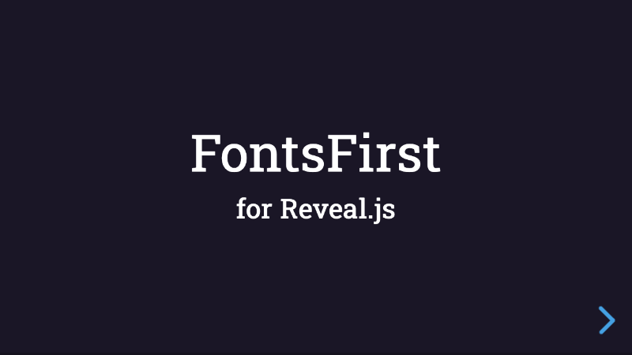

# FontsFirst

[](#) [](https://github.com/Martinomagnifico/reveal.js-fontsfirst/archive/refs/heads/master.zip)

A plugin for [Reveal.js](https://revealjs.com) that makes sure that your fonts get loaded before initialising Reveal.js.

[](https://martinomagnifico.github.io/reveal.js-fontsfirst/demo.html)

Sometimes when you use a Google or Typekit font, it takes some time to load the font. Your presentation will then first show in a default font and then jump to the correct font (known as a 'FOUT', a Flash Of Unstyled Text). 

Also, if you use an Adblocker like Ghostery, it is possible that the remote font will also not load at all. This plugin fixes that, but you do need to provide your self-hosted fallback fonts.

Here's a [demo](https://martinomagnifico.github.io/reveal.js-fontsfirst/demo.html) of a simple project that uses the FontsFirst plugin.


FontsFirst works like this:

* It uses WebFontLoader.js to load remote fonts.
* WebFontLoader.js checks if the remote loading works.
* WebFontLoader.js uses a timeout. If the time is up and remote fonts do not work, it provides a function in which you can provide your self-hosted fonts.
* To avoid the timeout each time the page is reloaded, the currently set way of loading the font is saved in a sessionStorage. This is reset only if the browser is quit.
* FontsFirst is a wrapper around WebFontloader and the sessionStorage: If either a remote font or self-hosted font is loaded, it will let Reveal.js continue loading. 


## Installation

The FontsFirst plugin has been rewritten for Reveal.js version 4.

If you want to use FontsFirst with an older version of Reveal, use the [1.0.0 version](https://github.com/Martinomagnifico/reveal.js-fontsfirst/releases).

FontsFirst needs an other script to be able to function: [WebFontLoader.js](https://github.com/typekit/webfontloader) by Typekit/Adobe and Google. This checks the availability of the remotely hosted webfonts.


### Regular installation

Copy the fontsfirst folder to the plugins folder of the reveal.js folder, like this: `plugin/fontsfirst`. The script for WebFontLoader is on a CDN, we add it as well.


```javascript
<script src="https://ajax.googleapis.com/ajax/libs/webfont/1.6.26/webfont.js"></script>
<script src="plugin/fontsfirst/fontsfirst.js"></script>
<script>
    Reveal.initialize({
        //...
        plugins: [ FontsFirst ]
    });
</script>
```
### npm installation

This plugin is published to, and can be installed from, npm.

```javascript
npm install reveal.js-fontsfirst
```
The FontsFirst plugin folder can then be referenced from `node_modules/reveal.js-fontsfirst/plugin/fontsfirst `


## Configuration

There are a few options that you can change from the Reveal.js options. The values below are default. It would be wise to change at least the modules and the selfhostcss options. 

```javascript
Reveal.initialize({
	// ...
	fontsfirst: {
		debug: false,
		modules: {
			google: {
				families: ['Roboto']
			}
		},
		selfhostcss : "/path/to/selfhostedfont.css",
		timeout: 1000
	},
	plugins: [ FontsFirst ]
});
```

* **`debug`**: This option, if set to true, will report in the console what gets loaded by WebFontLoader and what gets set in the sessionStorage. 
* **`modules`**: The modules option is where you set your Google, Typekit, Fontdeck or custom font. If you keep to the syntax described at [https://github.com/typekit/webfontloader](https://github.com/typekit/webfontloader), it will simply work. Just make sure that both the module and the selfhostcss refer to one font that you also use in your styling. Like this: `.reveal h3 { font-family: 'Roboto'; }`
* **`selfhostcss `**: This is where you should set the path to the CSS that will point to your self-hosted fonts.
* **`timeout `**: This is the timeout that WebFontLoader.js uses to load remote fonts. You can change it if you would like to give it some more or less time. 


## Like it?

If you like it, please star this repo.


## License
MIT licensed

Copyright (C) 2020 Martijn De Jongh (Martino)
